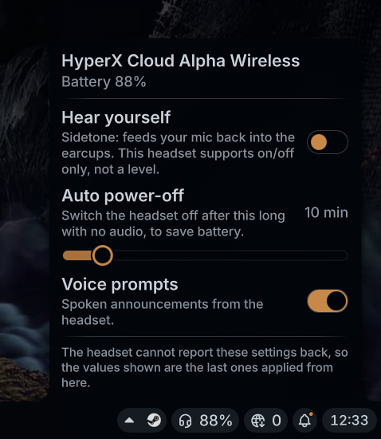

# Headset Control (noctalia plugin)

Shows a USB gaming headset's battery level in the noctalia bar, using
[`headsetcontrol`](https://github.com/Sapd/HeadsetControl).

Written for a HyperX Cloud Alpha Wireless (`0x03f0:0x098d`), but nothing is tied to that
device: every control is offered on whatever the connected headset reports. A headset with
no battery capability is supported too — it gets the icon alone in the bar, and keeps
whichever controls it does support.

## Requirements

- `headsetcontrol` (Arch: `pacman -S headsetcontrol`, official `extra` repo)
- noctalia-shell 4.7 or newer

`headsetcontrol` needs udev rules to reach the device as your own user. The
Arch package installs them; if you build it yourself, install
`udev/70-headsets.rules` from its source, or every control will fail
silently at the permission check. If the plugin cannot run `headsetcontrol`
at all, the panel says so rather than waiting forever for a device.

## Behaviour

- Polls `headsetcontrol -b -o json` on a timer (default 60s).
- Shows a headset icon plus the battery percentage.
- Turns the icon and label red at or below the low-battery threshold (default 20%), and
  switches to a warning icon so the cue is not colour alone.
- Shows a charging icon while charging.
- Hides itself while the headset is off or disconnected (configurable).
- Left-click opens a panel with mic monitoring (sidetone), auto power-off and
  voice prompt controls; right-click offers refresh and widget settings.

`headsetcontrol` can set sidetone, voice prompts and inactive time on this device
but cannot read them back, so the panel shows the last value applied from here.
Changing sidetone with the headset's own button (long-press) is therefore not
reflected in the panel.

## Other headsets

Nothing is hardcoded to one device. The plugin parses `headsetcontrol`'s JSON, so
the battery readout works for any supported headset that reports one, and each
control is shown only if the connected device reports the matching capability:

| Control | Requires |
|---|---|
| Battery readout (percentage in the bar) | `CAP_BATTERY_STATUS` |
| Hear yourself (sidetone) | `CAP_SIDETONE` |
| Auto power-off | `CAP_INACTIVE_TIME` |
| Voice prompts | `CAP_VOICE_PROMPTS` |

Only the first device `headsetcontrol` reports is used. With two supported
headsets attached at once, the bar shows the first one's battery, so treat
that case as unsupported for now.

If the device reports none of the three controls, the panel says so instead of
showing dead widgets. Capabilities are remembered from the last successful read,
so the panel does not empty out while the headset is asleep.

### Sidetone is on/off, not a level

The Cloud Alpha Wireless ignores the level byte `headsetcontrol` sends after the
sidetone enable command. Verified by sweeping levels 1, 2, 3, 4, 5, 6, 8, 10, 12,
16, 24, 32, 48, 64, 96 and 127 while talking: every non-zero level sounds
identical, and `128` silences it altogether — note that 128 is *within* the
range `headsetcontrol --help` documents (`-s <0-128>`), so that is the device
behaving oddly, not an out-of-range rejection. The reference GUI for this headset
only ever sends the on/off commands (`0x21bb1001` / `0x21bb1000`) and leaves its
level-response handler an empty stub, which matches that behaviour. The panel
therefore exposes sidetone as a toggle for this product id (`0x098d`), enabling it
at level 64. Any other device gets a 0-128 level slider — the range `headsetcontrol`
documents — on the assumption that it honours levels until someone measures otherwise.

To experiment with raw levels anyway:

    qs -c noctalia-shell ipc call plugin:headset-control sidetone 40

Refresh can also be triggered externally:

    qs -c noctalia-shell ipc call plugin:headset-control refresh

If you installed this from a plugin **source** rather than a checkout, noctalia keys the
plugin by source and the IPC target becomes `plugin:<hash>:headset-control`, where the
hash is the first six hex of the source URL's SHA-256 — the directory name under
`~/.config/noctalia/plugins` shows it.

## Translations

User-visible strings live in `i18n/en.json` and are looked up by key, so the
plugin can be translated without touching any QML. To add a language, copy
`i18n/en.json` to `i18n/<langCode>.json` (matching noctalia's language code,
e.g. `de`, `fr`, `pt`, `zh-CN`), translate the values, and re-run
`./install.sh`. Missing keys fall back to English.

## Install

**From noctalia**, add this repository as a plugin source in
`~/.config/noctalia/plugins.json`, then install "Headset Control" from
Settings -> Plugins.

**From a checkout**, run the installer at the repository root:

    ./install.sh            # symlink the packaged files into the plugin dir
    ./install.sh --copy     # copy instead, for a machine with no checkout

Then enable the plugin in `~/.config/noctalia/plugins.json` and add
`plugin:headset-control` to a bar section in `~/.config/noctalia/settings.json`.

Either way the plugin directory is a real directory, so the runtime
`settings.json` noctalia writes there stays out of the source tree.
